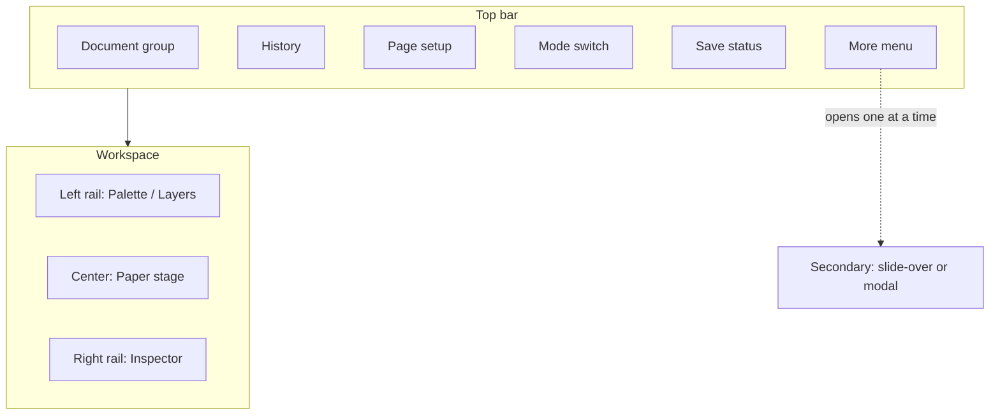

# Editor page-builder — Information architecture (IA)

**Status:** Accepted for implementation (P05-T00-04)  
**Laws:** `29-editor-pagebuilder-ux.mdc`, `07-document-editor.mdc`  
**ADRs:** 035 (columns), 036 (PDF preview)  
**Prompt pack:** `implementation-prompts/05-editor-pagebuilder/`

This document is the UX contract for redesigning `EditorShell`. **No React changes in the docs-only task**; implementers follow this in pack phases 01+.

---

## 0) Pain points in today’s UI (from `editor-shell.tsx`)

| Pain | Evidence / effect |
| --- | --- |
| Left column is a **panel farm** | Palette + Master + Workflow + Web publish + Share + Comments + Export + Versions + Inspector stacked in one `aside` |
| No clear **mode switch** | HTML preview is a third column always on; no `edit` / `htmlPreview` / `pdfPreview` |
| No **page setup** in chrome | Size/orientation/margins not first-class controls |
| No **Layers** tree | Selection only via canvas rows |
| No **paper frame** | Canvas reads as a list, not a page builder stage |
| Inspector not tabbed | Long single form; Content/Design/Advanced not separated |
| Secondary tools compete with building | Export/share/workflow always visible → cognitive overload |
| Weak empty/lock hierarchy | Warn strings exist but not structured banners + empty canvas CTA |

---

## A) First 30 seconds — user goal

1. Recognize they are in a **page builder** (paper in the center).  
2. Add or select a block from the **palette / layers**.  
3. Edit properties in the **inspector**.  
4. Know how to **preview** (HTML) and later **PDF preview** without hunting through a stack of panels.  
5. See **save status** and whether the document is locked.

---

## B) Desktop layout



ASCII (RTL UI chrome mirrored by CSS `dir`):

```text
┌──────────────────────────────────────────────────────────────────────────┐
│ ← Docs │ Title │ status │ locale │  Undo Redo │ Page ▾ │ Edit│HTML│PDF │ ● Saved │ ⋯ More │
├────────────┬─────────────────────────────────────────────┬───────────────┤
│ Palette    │           ┌─────────────────────┐           │ Inspector     │
│ ─────────  │           │      PAPER          │           │ Content       │
│ Layers     │  zoom − + │   (blocks / preview)│           │ Design        │
│            │  pages ●● │                     │           │ Advanced      │
│            │           └─────────────────────┘           │ or Page setup │
└────────────┴─────────────────────────────────────────────┴───────────────┘
```

---

## C) Glossary (EN → FA UI labels)

| Concept | EN (UI) | FA (پیشنهاد UI) | Notes |
| --- | --- | --- | --- |
| Canvas | Canvas | بوم | Interactive edit surface |
| Paper | Page / Paper | کاغذ / صفحه | Framed printable area |
| Block | Block | بلوک | One registry type instance |
| Section | Section | بخش | Nested flow container |
| Row | Row | ردیف | ADR 035 layout band |
| Column | Column | ستون | ADR 035 cell |
| Master | Master page | صفحهٔ مادر | Header/footer chrome |
| Layer | Layers | لایه‌ها | Structure tree |
| Inspector | Inspector / Properties | ویژگی‌ها | Right rail |
| Palette | Blocks / Palette | بلوک‌ها | Insert catalog |
| Mode | Editor / Preview | ویرایش / پیش‌نمایش | Top bar switch |
| HTML preview | HTML preview | پیش‌نمایش صفحه | Live brand HTML |
| PDF preview | PDF preview | پیش‌نمایش PDF | Queued job (ADR 036) |
| Final export | Download PDF | دانلود PDF نهایی | Entitlement + approval |

**i18n note:** Existing `editor.*` keys in `fa.json` / `en.json` use older wording (`flowTitle`, stacked panels). **Implementation phases must migrate keys** to match this glossary; do not leave conflicting labels (“flow list” vs “paper”). Docs-only task does not edit message files.

---

## D) Top bar groups

| Group | Contents |
| --- | --- |
| **Document** | Back to list, title input, workflow status chip (`draft`…), document locale |
| **History** | Undo / Redo |
| **Page** | Size, orientation, margins entry (opens page settings focus on right or popover) |
| **Mode** | Segmented: Edit \| HTML preview \| PDF preview |
| **Save** | Idle / saving / saved / error / readonly |
| **More (⋯)** | Masters, Workflow, Comments, Versions, Share links, Web publish, **Download final PDF**, Help/tour, Shortcuts |

Only **one** More-driven secondary surface open at a time (unless a non-blocking toast).

---

## E) Left rail

**Tabs or segmented control:**

1. **Palette**
   - Search
   - Groups: Structure / Text / Media / Data / Modules
   - Locked modules: disabled + upgrade CTA
   - Layout presets entry (phase 05) under Structure
2. **Layers**
   - Tree: pages → blocks (section/row/column children indented)
   - Click → select; reveal in canvas
3. **Optional shortcut:** “Masters” opens Masters in More/slide-over (not a third permanent tab if space is tight)

Collapse control: chevron to icon rail.

---

## F) Center stage

- **Paper frame** reflecting `page.size` / orientation / margin guides  
- **Zoom** − / % / + / Fit width (esp. HTML preview mode)  
- **Page navigator** for `pages[]` (add / reorder / delete with rules)  
- In `edit`: FlowCanvas (and nested structures)  
- In `htmlPreview`: HtmlPreview as hero  
- In `pdfPreview`: job status + PDF viewer  

Banner when pagination is approximate (HTML) or preview watermarked (PDF).

---

## G) Right rail — Inspector

**Tabs:** `Content` | `Design` | `Advanced`

| Selection | Right rail shows |
| --- | --- |
| Block selected | Inspector for that type |
| Nothing selected | **Page settings** (size, orientation, margins, print quality) + short document hints |
| `headerSlot` / `footerSlot` | Guidance → open Masters (not fake local header editing) |

---

## H) Secondary surfaces (placement)

| Surface | Placement | Why |
| --- | --- | --- |
| Comments | Slide-over | Frequent while editing; don’t steal inspector |
| Versions | Slide-over | Occasional |
| Workflow | Slide-over or modal steps | Gate-heavy |
| Share links | Modal | Form-heavy |
| Web publish | Modal / slide-over | Settings |
| Masters | Slide-over | Parallel to layers |
| Final PDF download | Modal or More panel (Export) | Distinct from PDF preview mode |
| PDF preview progress | **Inside center** in `pdfPreview` mode | Primary stage |

**Rule:** never mount all of today’s panels simultaneously in the left column.

---

## I) Mode behaviors

| Mode | Body editable | Left rail | Right rail | Center |
| --- | --- | --- | --- | --- |
| `edit` | Yes if writable & not body-locked | Full | Inspector / page settings | Paper + canvas |
| `htmlPreview` | No | Collapsed or read-only layers | Collapsed or page read-only | Paper + HTML preview + zoom |
| `pdfPreview` | No | Collapsed | Collapsed | Preview job UI + viewer |

**Shell (P05-T01-04):** Top-bar segmented control sets session-only `editorMode` (`edit` \| `htmlPreview` \| `pdfPreview`). Switching modes does not clear selection; returning to `edit` restores the three-rail layout. `pdfPreview` shows a placeholder until ADR 036 enqueue API ships — never enqueue Chromium from the mode switch itself.

Membership may still open HTML/PDF preview when subscription is read-only (ADR 036 for PDF). Mutations stay disabled.

---

## J) Breakpoint

| Width | Behavior |
| --- | --- |
| ≥ 1100px | Three rails + top bar as designed |
| 800–1099px | One side rail visible; the other via toggle; paper shrinks |
| < 800px | Rails become **drawers**; paper full width; top bar groups collapse into icons/More |

Touch targets ≥ 40px where practical. Desktop-first MVP is acceptable if drawers work.

---

## K) Empty & lock states

| State | UX |
| --- | --- |
| No blocks on active page | Center empty illustration + CTA “Add block” / “Start from layout” |
| No selection | Right rail = Page settings |
| `!writable` | Banner + disable mutations; preview modes OK |
| Body locked (review/approved/published) | Banner + link into Workflow slide-over to reopen path |
| Save error / offline | Persistent banner + Retry (phase 08) |
| Missing modules | Banner + upgrade CTA (keep) |

---

## L) Non-goals (UI)

- Showing `schemaVersion`, raw Mongo/document JSON, or internal block ids as the **primary** label  
- IDE-like debug consoles in production editor  
- Absolute free-canvas manipulators  
- Forcing Elementor mobile breakpoints in MVP (ADR 035)

---

## Implementation mapping

| IA slice | Prompt pack phase |
| --- | --- |
| Chrome / rails / mode shell | `01-workspace-chrome` |
| Page setup + paper + pages nav | `02-page-print-setup` |
| DnD / selection / shortcuts | `03-canvas-interactions` |
| Inspector depth | `04-block-design-panels` |
| Row/column | `05-layout-flexibility` |
| HTML preview delight | `06-html-preview-delight` |
| PDF preview | `07-pdf-preview-gate` |
| Command palette, tour, a11y | `08-productivity-delight` |
